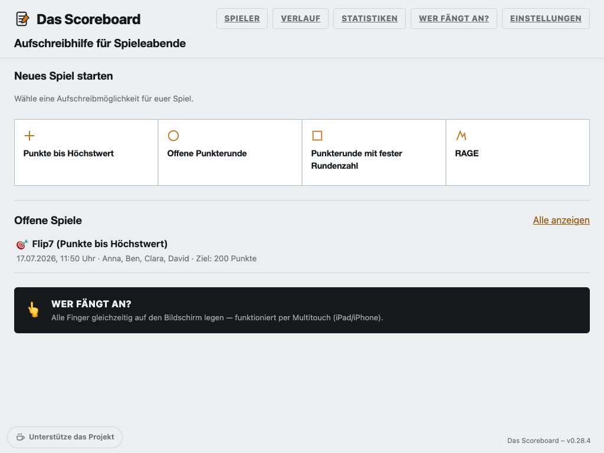
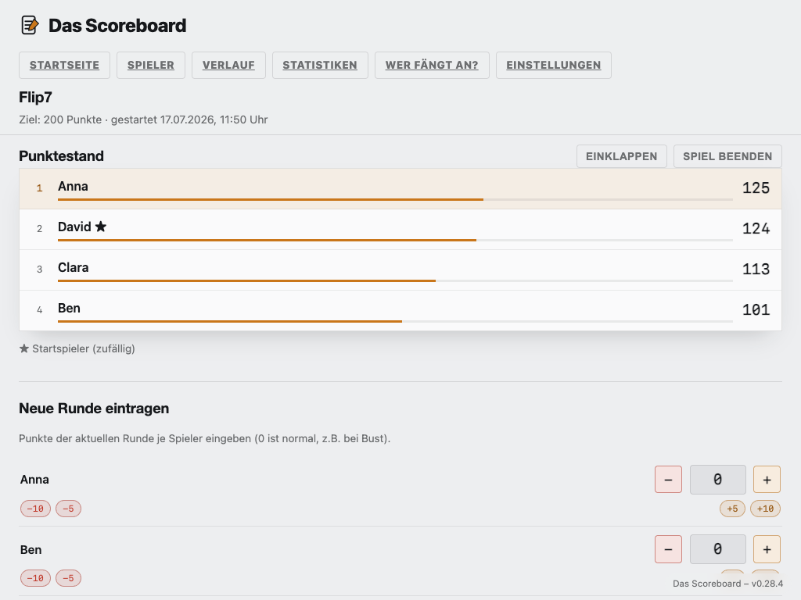
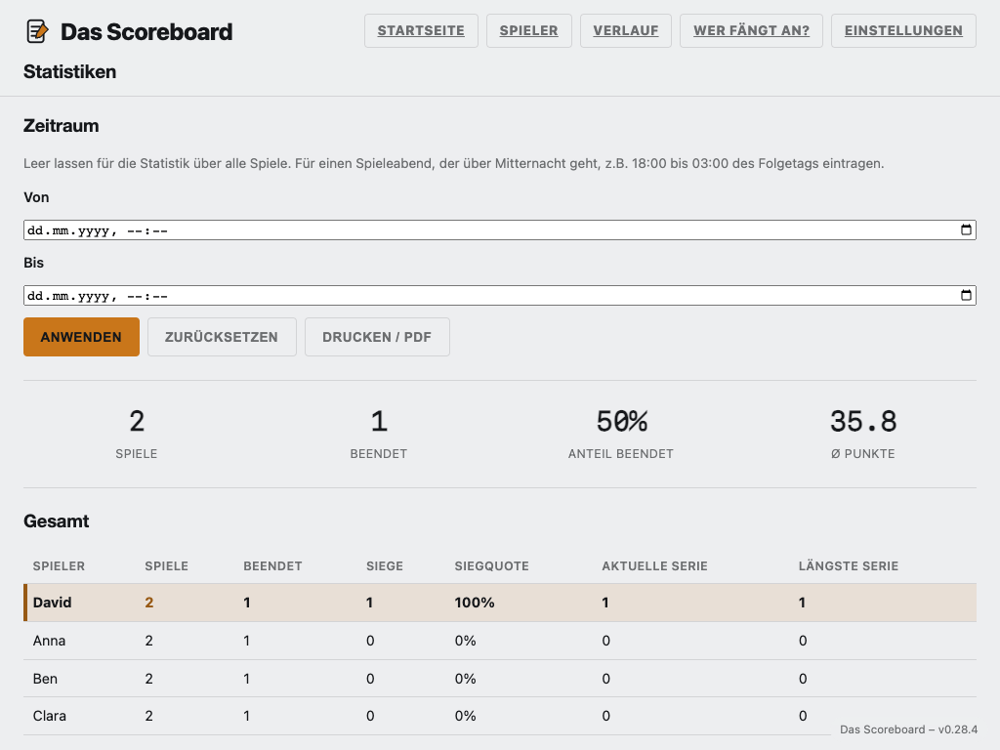

# Das Scoreboard

*English below.*

Aufschreibhilfe für Spieleabende. Reines PHP 8 + PDO/SQLite, kein Node,
keine separate Datenbank nötig — läuft auf normalem Webhosting per FTP-
Upload, gemacht für iPad und iPhone.

## Screenshots

<p>
  
  
  
</p>

*Aussehen "Flip Board" (Standard-Theme), Spielernamen im Screenshot sind
Beispieldaten.*

## Für Eilige

- **Was ist das?** Eine schlanke, selbst gehostete Web-App, um bei
  Spieleabenden Punkte mitzuschreiben — kein Konto, keine Cloud, keine
  Werbung, keine Tracking-Dienste.
- **Kurz ausprobieren** (benötigt lokal installiertes PHP 8 mit
  `pdo_sqlite`):
  ```bash
  php -S localhost:8090
  ```
  danach <http://localhost:8090> öffnen. Alternativ in einem Docker-
  Container ganz ohne lokale PHP-Installation:
  ```bash
  docker run --rm -p 8090:80 -v "$PWD:/var/www/html" php:8.3-apache \
    bash -c "docker-php-ext-install pdo_sqlite && apache2-foreground"
  ```
- **Auf einem eigenen Server betreiben**: kompletten Ordnerinhalt per
  FTP/SFTP auf einen PHP-8-Webspace mit `pdo_sqlite`-Extension hochladen
  — fertig, kein Build-Schritt.
- **Für eine geschlossene Gruppe absichern**: unter Einstellungen →
  "Zugangsschutz" lässt sich ein gemeinsames Passwort aktivieren (siehe
  Abschnitt "Zugangsschutz" unten).
- **Lizenz**: kostenlos für nicht-kommerzielle Nutzung, siehe
  [Lizenz](#lizenz) unten.

## Was die App kann

- **Vier Aufschreibmodi**: *Punkte bis Höchstwert* (z.B. Flip7, Tutto),
  *Offene Punkterunde* (z.B. Doppelkopf), *Punkterunde mit fester
  Rundenzahl* und *RAGE* (Stichspiel mit automatischer Punkteberechnung).
- **Eigene Spiele**: fertig konfigurierte Varianten der drei
  Punkte-Modi (z.B. "Flip7" mit Zielwert 200, eigenen Punkteschritten
  und einem frei wählbaren Icon aus über 30 Symbolen) unter
  Einstellungen → Meine Spiele anlegen. Favoriten erscheinen in einer
  eigenen, manuell sortierbaren Reihe oben auf der Startseite,
  zusätzlich alphabetisch in der vollständigen Liste aller Spiele
  (inkl. RAGE) darunter — ein Klick füllt das Einrichten-Formular
  direkt vor.
- **Spielerverwaltung**: zentrale Namensliste zur Schnellauswahl, dazu
  optionale Spielergruppen (z.B. "Familie") für Ein-Klick-Auswahl.
- **Team-Modus**: in den drei Punkte-Modi lassen sich Spieler zu Teams
  zusammenfassen, wahlweise mit gemeinsamem oder individuellem Punktwert.
- **Spieler-Avatare**: optionales Foto pro Spieler, direkt im Punktestand
  sichtbar.
- **Verlauf & Statistiken**: alle Spiele mit Filter nach Status, dazu eine
  Auswertungsseite mit Siegquoten, Kopf-an-Kopf-Vergleich und
  Zeitraumfilter (inkl. Drucken/PDF).
- **"Wer fängt an?"**: Multitouch-Fingerauswahl für iPad/iPhone.
- **Mehrsprachig**: Deutsch und Englisch, umschaltbar in den
  Einstellungen.
- **Als App installierbar**: "Zum Home-Bildschirm hinzufügen" auf
  iPad/iPhone — läuft danach wie eine eigene App, ohne Adressleiste.
- **Backup & Wiederherstellung**: komplette Datensicherung als ZIP-Datei
  herunterladen oder wiederherstellen, z.B. bei einem Server-Umzug.

## Aussehen

Standard ist **Flip Board** — eine Anzeigetafel-Optik mit flachen,
kantigen Flächen statt runder Karten. Zusätzlich stehen **Classic**
(dezent, individuell per Hex-Farben anpassbar) und **Bold Scorekeeper**
(dunkles, hochkontrastiges Theme) zur Wahl. Umschaltbar unter
Einstellungen → Aussehen, jeweils mit eigener Akzentfarben-Auswahl.

## Zugangsschutz

Standardmäßig deaktiviert (Seite für jeden mit dem Link nutzbar). Unter
Einstellungen → Zugangsschutz lässt sich ein gemeinsames Passwort
aktivieren (kein Konten-System, ein Passwort für alle) — schützt dann
sowohl alle Seiten als auch alle API-Endpunkte. **Passwort vergessen?**
Per FTP/SFTP/SSH (Datei-Zugriff, kein Web-Zugriff nötig) eine leere Datei
`data/reset-password.txt` anlegen — beim nächsten Seitenaufruf wird der
Zugangsschutz automatisch deaktiviert und die Marker-Datei entfernt.

## Voraussetzungen beim Hoster

- PHP 8.x mit aktivierter `pdo_sqlite`-Extension.
- Schreibrechte für den Ordner `data/`.
- Kein mod_rewrite nötig.

## Deployment

Kompletten Ordnerinhalt per FTP/SFTP ins Webroot hochladen. Die SQLite-
Datei `data/scoreboard.sqlite` wird beim ersten Request automatisch
angelegt.

## Aktualisieren

Neue Code-Version per FTP/SFTP hochladen, dabei **den `data/`-Ordner
nicht überschreiben** (dort liegen alle Spieler, Spiele und Runden). Das
Datenbankschema gleicht sich beim nächsten Seitenaufruf automatisch an,
bestehende Daten gehen dabei nie verloren.

## Mehrsprachigkeit

Die komplette Oberfläche ist auf Deutsch und Englisch verfügbar,
umschaltbar unter Einstellungen → Sprache.

## Datenschutz

Diese Software ist zum Selbst-Hosten gedacht — es gibt keinen zentralen
Anbieter, keine Cloud-Anbindung und keine externen Analyse- oder
Tracking-Dienste. Alle Daten (Spielernamen, Spielstände, optionale
Avatar-Fotos, Logo-Uploads, Einstellungen) landen ausschließlich in der
lokalen SQLite-Datenbank auf dem jeweils eigenen Server und werden an
keine dritte Stelle übertragen.

- **Cookies/Speicherung im Browser**: ein Session-Cookie, ausschließlich
  für den optionalen Zugangsschutz — ohne aktivierten Zugangsschutz wird
  kein Cookie gesetzt. Zusätzlich einige rein clientseitige
  `localStorage`-Einträge (z.B. gemerkte Anzeige-Einstellungen) ohne
  Server-Bezug.
- **Externe Anfragen**: einzig die Versionsanzeige fragt beim Laden die
  öffentliche GitHub-API nach der neuesten Release-Version ab (kein
  Tracking, keine personenbezogenen Daten in der Anfrage).
- **Verantwortung**: Wer diese Software für eine eigene Gruppe betreibt,
  ist selbst für die datenschutzrechtliche Einordnung (z.B. DSGVO)
  verantwortlich. Empfehlenswert für nicht-öffentliche Nutzung: den
  Zugangsschutz aktivieren.

## Sicherheit

Vor der Veröffentlichung wurde ein manueller Sicherheitscheck
durchgeführt (Code-Review + gezielte Exploit-Versuche in isolierter
Testumgebung). Unter anderem umgesetzt:

- Konsequentes Escaping aller nutzergenerierten Texte (Spieler-, Team-
  und Gruppennamen) gegen gespeichertes XSS.
- Ausschließlich vorbereitete SQL-Anweisungen, keine Eingabe-
  Konkatenation.
- Datei-Uploads (Avatar/Logo) mit serverseitiger Inhaltsprüfung, keine
  Pfad-Traversierung möglich.
- Zugangsschutz-Session mit `HttpOnly`, `SameSite` und (unter HTTPS)
  `Secure`-Cookie, Schutz gegen Session-Fixation, bcrypt-Passwort-Hash.

Trotzdem gilt wie bei jeder Software: keine Garantie auf absolute
Fehlerfreiheit. Sicherheitsrelevante Hinweise gerne als Issue.

## Unterstützen

Wenn dir "Das Scoreboard" gefällt und du magst: über
[buymeacoffee.com/thomashageleit](https://buymeacoffee.com/thomashageleit)
kannst du das Projekt unterstützen. Völlig freiwillig, die Software
bleibt davon unabhängig frei nutzbar.

## Lizenz

[PolyForm Noncommercial License 1.0.0](LICENSE) — freie Nutzung, Veränderung
und Weitergabe für nicht-kommerzielle Zwecke (privates Hosting, Hobby-Projekte,
gemeinnützige/Bildungseinrichtungen). Für kommerzielle Nutzung bitte vorher
Kontakt aufnehmen.

---

# Das Scoreboard (English)

Scorekeeping helper for game nights. Pure PHP 8 + PDO/SQLite, no Node, no
separate database needed — runs on plain webhosting via FTP upload, built
for iPad and iPhone.

## Screenshots

<p>
  
  
  
</p>

*"Flip Board" appearance (default theme), player names shown are sample
data.*

## Quick start

- **What is this?** A lightweight, self-hosted web app for keeping score
  at game nights — no account, no cloud, no ads, no tracking services.
- **Try it locally** (requires PHP 8 with `pdo_sqlite` installed):
  ```bash
  php -S localhost:8090
  ```
  then open <http://localhost:8090>. Or, without installing PHP locally,
  run it in a Docker container:
  ```bash
  docker run --rm -p 8090:80 -v "$PWD:/var/www/html" php:8.3-apache \
    bash -c "docker-php-ext-install pdo_sqlite && apache2-foreground"
  ```
- **Run it on your own server**: upload the entire folder via FTP/SFTP to
  a PHP 8 webspace with the `pdo_sqlite` extension — done, no build step.
- **Lock it down for a private group**: under Settings → "Access
  protection" you can enable a shared password (see the "Access
  protection" section below).
- **License**: free for noncommercial use, see [License](#license) below.

## What it does

- **Four scorekeeping modes**: *Points to target* (e.g. Flip7, Tutto),
  *Open point round* (e.g. Doppelkopf), *Points round with fixed round
  count*, and *RAGE* (a trick-taking card game with automatic scoring).
- **Custom games**: save fully configured variants of the three
  point-based modes (e.g. "Flip7" with a target of 200, its own step
  sizes, and a freely chosen icon from over 30 symbols) under Settings
  → My games. Favorites get their own, manually sortable row at the
  top of the home page, and also appear alphabetically in the full
  list of all games (incl. RAGE) below — one click pre-fills the setup
  form.
- **Player management**: a central name list for quick selection, plus
  optional player groups (e.g. "Family") for one-click selection.
- **Team mode**: in the three point-based modes, players can be grouped
  into teams, with either a combined or an individual score.
- **Player avatars**: an optional photo per player, shown right in the
  standings.
- **History & statistics**: all games with a status filter, plus a stats
  page with win rates, head-to-head comparisons, and a date-range filter
  (including print/PDF).
- **"Who starts?"**: a multitouch finger-picker for iPad/iPhone.
- **Multi-language**: German and English, switchable in settings.
- **Installable as an app**: "Add to Home Screen" on iPad/iPhone — opens
  afterward like its own app, without the address bar.
- **Backup & restore**: download a complete backup as a ZIP file or
  restore one, e.g. when moving to a new server.

## Appearance

The default is **Flip Board** — a departure-board look with flat,
sharp-edged surfaces instead of rounded cards. Also available: **Classic**
(understated, individually customizable via hex colors) and **Bold
Scorekeeper** (a dark, high-contrast theme). Switchable under Settings →
Appearance, each with its own accent color picker.

## Access protection

Disabled by default (the site is usable by anyone with the link). Under
Settings → Access protection you can enable a shared password (no
account system, one password for everyone) — protects both every page
and every API endpoint. **Forgot the password?** Create an empty file
`data/reset-password.txt` via FTP/SFTP/SSH (file access, no web access
needed) — on the next page load, access protection is automatically
disabled and the marker file removed.

## Hosting requirements

- PHP 8.x with the `pdo_sqlite` extension enabled.
- Write permissions for the `data/` folder.
- No mod_rewrite needed.

## Deployment

Upload the entire folder contents via FTP/SFTP to the webroot. The
SQLite file `data/scoreboard.sqlite` is created automatically on the
first request.

## Upgrading

Upload the new code version via FTP/SFTP, making sure **not to overwrite
the `data/` folder** (that's where all players, games, and rounds live).
The database schema aligns itself automatically on the next page load;
existing data is never lost.

## Multi-language support

The entire interface is available in German and English, switchable
under Settings → Language.

## Privacy

This software is meant to be self-hosted — there is no central provider,
no cloud connection, and no external analytics or tracking services. All
data (player names, scores, optional avatar photos, logo uploads,
settings) lives exclusively in the local SQLite database on your own
server and is never sent anywhere else.

- **Cookies/browser storage**: one session cookie, used only for the
  optional access protection — no cookie is set unless access protection
  is enabled. A few purely client-side `localStorage` entries (e.g.
  remembered display settings) with no server involvement.
- **External requests**: only the version display queries the public
  GitHub API on load for the latest release version (no tracking, no
  personal data in the request).
- **Responsibility**: whoever runs this software for their own group is
  responsible for its data-protection compliance (e.g. GDPR). For
  non-public use, enabling access protection is recommended.

## Security

A manual security review was performed before release (code review plus
targeted exploit attempts in an isolated test environment). Among other
things:

- Consistent escaping of all user-generated text (player, team, and
  group names) against stored XSS.
- Exclusively prepared SQL statements, no input concatenation.
- File uploads (avatar/logo) validated server-side by content, no path
  traversal possible.
- Access-protection session with `HttpOnly`, `SameSite`, and (under
  HTTPS) `Secure` cookie flags, protection against session fixation,
  bcrypt password hashing.

As with any software, that's not a guarantee of being bug-free.
Security-relevant reports are welcome as an issue.

## Support

If you like "Das Scoreboard" and want to support it: you can do so via
[buymeacoffee.com/thomashageleit](https://buymeacoffee.com/thomashageleit).
Entirely optional — the software stays free to use either way.

## License

[PolyForm Noncommercial License 1.0.0](LICENSE) — free to use, modify, and
share for noncommercial purposes (personal hosting, hobby projects,
charitable/educational organizations). For commercial use, please get in
touch first.
